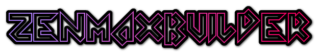
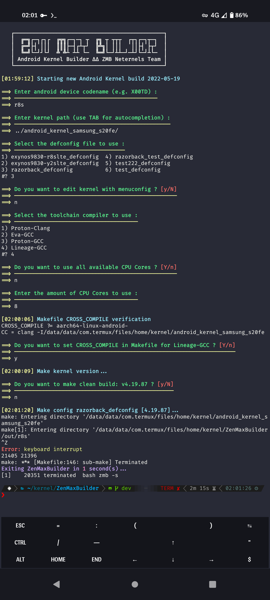

---
{ % seo % }
---

 

 

 
# Table of Contents

- [Overview](https://kernel-builder.com#overview)
- [Requirements](https://kernel-builder.com#requirements)
- [Usage](https://kernel-builder.com#usage)
- [Options](https://kernel-builder.com#options)
- [Working Structure](https://kernel-builder.com#working-structure)
- [Screenshots](https://kernel-builder.com#screenshots)
- [Warning](https://kernel-builder.com#warning)
- [Contributing](https://kernel-builder.com#contributing)
- [Reporting Issues](https://kernel-builder.com#reporting-issues)
- [Help us Translate ZenMaxBuilder](https://kernel-builder.com#help-us-translate-zenmaxbuilder)
- [License](https://kernel-builder.com#license)
- [Credits](https://kernel-builder.com#credits)

 
# Overview

ZenMaxBuilder (ZMB) is an Android Kernel Builder written in bash, which can be runned on any compatible Linux System (feel free to Pull Request for Windows support). By default it uses Proton-Clang, Eva-GCC, Proton-GCC or Lineage-GCC but you can use any Clang or GCC toolchains you like (with LLVM and binutils included). Find all your compilations and working folders in one place, edit and maintain your kernels faster. Full logs with the possibility to restart the build after error. Automatic creation of a flashable signed ZIP (with AK3 and AOSP Keys). Real time status feedback with ZIP sending on any group or Telegram channel. And more. The perfect tool to compile on the fly and keep fresh and clean kernel paths.

 
# Requirements

A computer running Linux, the source code of the phone kernel, a minimum of knowledge in kernel compilation and a lot of patience.

The installation of the missing dependencies will be offered by ZenMaxBuilder but you can also install them manually with your favorite package manager:

    bash sed wget git curl zip tar expect make cmake automake autoconf llvm lld lldb clang gcc binutils bison perl libtool gperf gawk flex bc python zstd ninja openssl

The optional flashable zip signature with AOSP Keys requires java (JDK) which is not proposed to install by ZenMaxBuilder (openjdk recommended).

 
# Usage

➡ Clone and enter ZMB repository

    git clone https://github.com/grm34/ZenMaxBuilder;
    cd ZenMaxBuilder

➡ Create a copy of [settings.cfg](https://github.com/grm34/ZenMaxBuilder/blob/zmb/etc/settings.cfg) to set your settings (optional)

    cp etc/settings.cfg etc/user.cfg;
    vi etc/user.cfg

➡ Start ZMB and follow instructions

    bash zmb --start

 
# Options

    Usage: bash zmb [OPTION] [ARGUMENT] (e.g. bash zmb --start)

    Options
        -h, --help                      show this message and exit
        -s, --start                     start new kernel compilation
        -u, --update                    update script and toolchains
        -l, --list                      show list of your kernels
        -t, --tag            [v4.19]    show the latest Linux tag
        -m, --msg          [message]    send message on Telegram
        -f, --file            [file]    send file on Telegram
        -z, --zip     [Image.gz-dtb]    create flashable zip
        -d, --debug                     start compilation in debug mode

 
# Working Structure

    ZenMaxBuilder/
    |
    |---- builds/               # Flashable kernel zips
    |     |---- DEVICE1/
    |     |---- DEVICE2/
    |
    |---- logs/                 # Compilation build logs
    |     |---- DEVICE1/
    |     |---- DEVICE2/
    |
    |---- out/                  # Kernel working directories
    |     |---- DEVICE1/
    |     |---- DEVICE2/

 
# Screenshots

 
# Warning

ZMB is a tool to facilitate the compilation of the Android kernel, it does not touch at your kernel source and does not adds possible modifications that must be made, except the setting of CROSS_COMPILE in the main Makefile (all others toolchain options from ZMB settings will be passed directly to make as command-line argument):

    # Proton-Clang / Proton-GCC
    CROSS_COMPILE ?= aarch64-linux-gnu-
    CC             = clang

    # Eva-GCC
    CROSS_COMPILE ?= aarch64-elf-
    CC             = aarch64-elf-gcc

    # Lineage-GCC
    CROSS_COMPILE ?= aarch64-linux-android-
    CC             = aarch64-linux-android-gcc

Kernel sources are often configured for a specific compilation (vendor, firmware, modules, android version, compiler) and little changes are often necessary.

 
# Contributing

If you want to contribute to ZenMaxBuilder project and make it better, your help is very welcome: [Contributing Guidelines](https://github.com/grm34/ZenMaxBuilder/blob/zmb/.github/CONTRIBUTING.md).

 
# Reporting Issues

Found a problem? Want a new feature? Have a question? First of all see if your issue, question or idea has [already been reported](https://github.com/grm34/ZenMaxBuilder/issues). If don't, just open a [new clear and descriptive issue](https://github.com/grm34/ZenMaxBuilder/issues/new/choose).

 
# Help us Translate ZenMaxBuilder

| language | flag | translator | progress |
| :------- | ---: | ---------: | -------: |
| English  |   🇬🇧 |     @grm34 |     100% |
| Spanish  |   🇪🇸 |     @grm34 |     100% |
| French   |   🇫🇷 |     @grm34 |     100% |
| German   |   🇩🇪 |    @Besix2 |     100% |

 
# License

    MIT License

    Copyright (c) 2021-2022 @grm34 Neternels Team

    Permission is hereby granted, free of charge, to any person
    obtaining a copy of this software and associated documentation
    files (the "Software"), to deal in the Software without restriction,
    including without limitation the rights to use, copy, modify, merge,
    publish, distribute, sublicense, and/or sell copies of the Software,
    and to permit persons to whom the Software is furnished to do so,
    subject to the following conditions:

    The above copyright notice and this permission notice shall be
    included in all copies or substantial portions of the Software.

    THE SOFTWARE IS PROVIDED "AS IS", WITHOUT WARRANTY OF ANY KIND,
    EXPRESS OR IMPLIED, INCLUDING BUT NOT LIMITED TO THE WARRANTIES OF
    MERCHANTABILITY, FITNESS FOR A PARTICULAR PURPOSE AND NONINFRINGEMENT.
    IN NO EVENT SHALL THE AUTHORS OR COPYRIGHT HOLDERS BE LIABLE FOR ANY
    CLAIM, DAMAGES OR OTHER LIABILITY, WHETHER IN AN ACTION OF CONTRACT,
    TORT OR OTHERWISE, ARISING FROM, OUT OF OR IN CONNECTION WITH THE
    SOFTWARE OR THE USE OR OTHER DEALINGS IN THE SOFTWARE.

 
# Credits

- Neternels Team: [https://neternels.org](https://neternels.org)
- Proton-Clang: [@kdrag0n](https://github.com/kdrag0n)
- Eva-GCC: [@mvaisakh](https://github.com/mvaisakh)
- Lineage-GCC: [@LineageOS](https://github.com/LineageOS)
- AnyKernel3: [@osm0sis](https://github.com/osm0sis)
- ZipSigner: [@osm0sis](https://github.com/osm0sis) [@topjohnwu](https://github.com/topjohnwu)

 
## Buy me a beer ?

If you feel like buying me a beer donations are welcome :

    LTC: MHjiEKDw7SAtx6HzSeFEWTfEUiVUak2wUD
    BTC: 356URzmeVn8AF8WxMtqipP2qQ3gwZQHdRi
    BCH: 1MrG2pNek2v1nM2JShjW6gnxvS9sdxaytw
    DOGE: DEMJp1QLze6n76h2f4KH6a55UBETuZHdMp
    GTC: 0x349319b09D93EE3576F99622fDEE1388f42a82B0
    ETH: 0x445bd5EF7f36CF09135F23dd9E85B8De9fab2199
